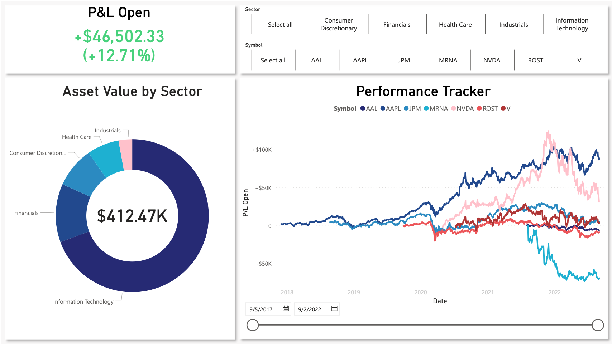

# Open Positions Tracker
This is a dashboard that shows the five-year performance of stocks in which an investor is having open positions in. This is suitable for traders who wants to really focus on how the current portfolio performs before adjusting strategies or even closing positions. In this project, only S&P500 stocks are included for demonstration.<br>


## Queries
```StockData``` <br>
This is the main table that contains all information that the dashboard needs, including transaction details, sectors and daily closes of all trading days since the opening. The data come from all other queries.

```OpenPositions```<br>
The data come from ```OpenPositions.xlsx``` and this is the only data source that requires manual input. This is the record of the investor's open positions containing 4 columns: ```Symbol```, ```Buy Date```, ```Qty``` as well as ```Buy Price```, and should be updated when necessary.

```Sectors```<br>
Sectors that stocks belong to. The data source is [this Wikipedia page](https://en.wikipedia.org/wiki/List_of_S%26P_500_companies).

```Timestamp```<br>
This calculates UNIX timestamps of current time and 5 years ago which are used in ```fxData```to retrieve data.

```fxData```<br>
This is a function that imports stock data from Yahoo Finance to ```StockData``` table without doing it manually. It automatically gets data by filling the data retrieval URL with symbol from ```OpenPositions``` and timestamps from ```Timestamp```.